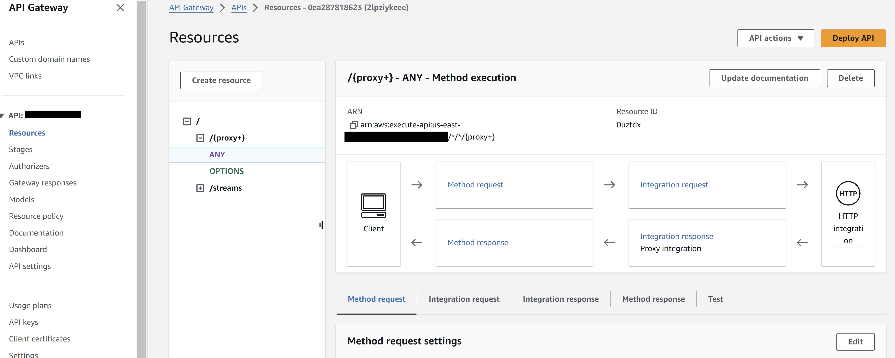
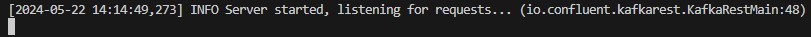

# Pintrest Data Pipeline

# A description of the project

Pinterest, a popular social media platform and visual discovery engine, allows users to save and share ideas through images and videos known as "pins." Users organise their pins into themed collections called "boards," covering diverse topics like home decor, fashion, recipes, and more. With vast data storage and processing billions of data points daily, Pinterest aims to enhance user experience by leveraging data insights.

This project aims to replicate Pinterest's data processing system by creating an end-to-end pipeline on the AWS Cloud. The pipeline orchestrates data ingestion, storage, and real-time analysis, utilising a range of technologies:

- Amazon Elastic Compute Cloud (EC2) for computing resources
- Amazon Simple Storage Service (S3) for scalable object storage
- SQL for data querying and manipulation
- Apache Kafka/AWS Managed Streaming for Apache Kafka (MSK) for streaming data processing
- Amazon API Gateway for creating APIs
- Spark for distributed data processing
- Databricks for data engineering and analytics
- Amazon Managed Workflows for Apache Airflow (MWAA) for workflow orchestration
- Amazon Kinesis for real-time data streaming

By leveraging these technologies, this project aims to demonstrate how to build a secure, robust and scalable data processing pipeline similar to that of Pinterest via AWS Cloud. Additionally, the pipeline facilitates value extraction through SQL queries, enhancing the project's analytical capabilities.


# Installation instructions
From the main/root directory of the project folder, follow these steps:

1. cd into the directory and then in the command line:
    ```bash
    git clone https://github.com/chemi5t/pinterest-data-pipeline905.git
    ```
2. Set up a virtual environment for the project:
    ```bash
    conda create --name pinterest_env
    ```
    ```bash
    conda activate pinterest_env
    ```
    ```bash
    pip install -r requirements.txt
    ```
- Packages of note:                 ########### update this ###########
    - boto3==1.34.21 
    - nbformat==5.9.2 
    - numpy==1.26.2 
    - pandas==2.1.3 
    - python-dateutil==2.8.2 
    - python-decouple==3.8 
    - PyYAML==6.0.1 
    - requests==2.31.0 
    - SQLAlchemy==2.0.23 
    - tabula-py==2.9.0
3. Create and set up AWS and Databricks accounts.
4. Save your database credentials to `db_creds.yaml` for security and to enable data extraction/uploads from/to various sources. Detailed instructions on setting these up and configuring credentials can be found wothin the Milestones explained later.

that contains only the year from the timestamp column
      number_users_joined, a new column containing the desired query output


# Summary of Project Milestones 

## Batch Processing:

### **Outcomes from Milestone 1 (Setting up the environment):**
`GitHub` was successfully set up to allow the project to be saved and tracked for changes via `Git` and `GitHub`. `VSCode` was used for writing the code.

This project uses different services running in the AWS Cloud and thus an AWS Cloud Account is required. 

### **Outcomes from Milestone 2 (Creating Pinterest infrastructure via AWS RDS database):**

The Pinterest infrastructure is replicated to resemble the environment of a data engineer at Pinterest. 

A `user_posting_emulation_basic.py` script is developed, containing RDS database login credentials. The RDS database comprises three tables (pinterest_data, geolocation_data, and user_data) mimicking data obtained from user POST requests to Pinterest:

`pinterest_data`: Information about posts updated to Pinterest.
`geolocation_data`: Geographic data corresponding to posts in `pinterest_data`.
`user_data`: User information linked to posts in `pinterest_data`.

A `db_creds.yaml` file is created to store database credentials securely and excluded from version control using .gitignore.

The script continuously executes, emulating user posting behavior by connecting to the RDS database via SQLAlchemy. It fetches random rows from each table (pin_result, geo_result, and user_result), simulating user activity. The key-value pairing in the dictionaries are noted for later analysis.

```python
(base) 
chemi@DELL-laptop MINGW64 ~/AiCore_Projects/pinterest-data-pipeline905 (main)
$ python user_posting_emulation_basic.py 
**************************************************
pin result:  {'index': 7528, 'unique_id': 'fbe53c66-3442-4773-b19e-d3ec6f54dddf', 'title': 'No Title Data Available', 'description': 'No description available Story format', 'poster_name': 'User Info Error', 'follower_count': 'User Info Error', 'tag_list': 'N,o, ,T,a,g,s, ,A,v,a,i,l,a,b,l,e', 'is_image_or_video': 'multi-video(story page format)', 'image_src': 'Image src error.', 'downloaded': 0, 'save_location': 'Local save in /data/mens-fashion', 'category': 'mens-fashion'}

geo result:  {'ind': 7528, 'timestamp': datetime.datetime(2020, 8, 28, 3, 52, 47), 'latitude': -89.9787, 'longitude': -173.293, 'country': 'Albania'}

user result:  {'ind': 7528, 'first_name': 'Abigail', 'last_name': 'Ali', 'age': 20, 'date_joined': datetime.datetime(2015, 10, 24, 11, 23, 51)}
**************************************************
```

Next, log into the AWS console keeping safe your credentials:

- AWS Account ID: <your_AWSId>
- IAM user name: <your_UserId>
- Password: <your_Password>
- The above are values to be replaced by your own and where ever mentioned herein

When using any of the AWS services, make sure to work in `us-east-1` region throughout the project.

### **Outcomes from Milestone 3 (Batch processing: Configuring the EC2 Kafka client):**
- ### Launching an EC2 Instance

Install `Kafka` and the `IAM MSK authentication package` on the client `EC2` machine.
Retrieve and note the `IAM role ARN` (<your_UserId>-ec2-access-role) for cluster authentication.
Configure `Kafka` client for `IAM authentication`. Modify the `client.properties` file in the `Kafka` installation directory to enable `AWS IAM authentication`.
Create `Kafka` topics by retrieving the `Bootstrap servers` string and the Plaintext `Apache Zookeeper` connection string from the `MSK` Management Console.
Create three topics: 
- `<your_UserId>.pin` for Pinterest posts data, 
- `<your_UserId>.geo` for post geolocation data, and 
- `<your_UserId>.user` for post user data.

An `Amazon EC2` instance is utilised as an `Apache Kafka` client machine.

Log into youyr `AWS account` and access the `EC2` home page. Select `Launch instance` and name the `EC2 instance` something memorable i.e. <your_UserId>.

- #### Selecting an AMI

In the Application and OS Images (Amazon Machine Image) section, select the desired Amazon Machine Image (`AMI`) i.e  `Amazon Linux 2 AMI(HVM)`.

An `AMI` includes the root file system, launch permissions, and block device mappings. It provides a complete package that allows you to quickly and easily launch instances with a specific operating system, software stack, and application environment.

- #### Selecting an Instance Type

Locate the desired `Instance type` and make your selction i.e. `t2.micro`. Then select `Launch instance` to launch your first instance. 

- #### Create a Key Pair 

Create your Key Pair name i.e.`<your_UserId>-key-pair` and select `Create key pair` which will create you the `<your_UserId>-key-pair.pem` to save.

It is essential to securely store your private key and prevent unauthorised access to it. 

- #### Connect to an EC2 instance via SSH client

SSH client is a widely used protocol for connecting to remote instances using SSH key pairs. To connect to an EC2 instance via SSH, you need to have the private key associated with the key pair used during instance launch as above or one created as below.

To create your Key Pair, a local `.pem` key file is created to establish a `SSH` connection with the `EC2` instance.
Navigate to the `Paramter Store` in the AWS account and use the `KeyPairId` accosiated with the EC2 instance created; given by AiCore. Using your `KeyPairId` find the specific key pair associated with the EC2 instance. Select this key pair and under the `Value` field select 'Show decrypted value'. This will reveal the content of your key pair. Copy its entire value (including the BEGIN and END header) and paste it in the `.pem` file in `VSCode`.


Navigate to the `EC2` console on `AWS` and identify the instance with your unique `<your_UserId>`. Select this instance, and under the `Details` section find the `key pair name` and make a note of this. Save the previously created `.pem` file in `VSCode` using the following format: `<your_UserId>-key-pair.pem`. Move this file into the linux home directory, "\\wsl.localhost\Ubuntu\home"


Alternatively rather than moving the `.pem` file you can create this via being in the desired destination/terminal as outlined below. Note, once you pass the command `nano UserId-key-pair.pem`, paste in the `Value` copied from earlier.

```wsl
(base) root@DELL-laptop:/mnt/c/Users/chemi/AiCore_Projects/pinterest-data-pipeline905# cd /
(base) root@DELL-laptop:/# ls
bin  boot  dev  etc  home  init  lib  lib32  lib64  libx32  lost+found  media  mnt  opt  proc  root  run  sbin  snap  srv  sys  tmp  usr  var
(base) root@DELL-laptop:/# cd home
(base) root@DELL-laptop:/home# nano <your_UserId>-key-pair.pem
(base) root@DELL-laptop:/home# ls
<your_UserId>-key-pair.pem
```
KEY: <your_UserId>: replace with your own details

Then connect to the `EC2` instance using `SSH` client instructions provided via AWS Cloud in the `EC2` console>Instances, open the EC2 instance and select `Connect`.


Continuing from the terminal above where the `.pem` file is located. Set the the appropriate permissions for the private key file to ensure it is only accessible by the owner: 

```wsl
chmod 400 /path/to/private_key.pem
```

Then use the `SSH command` from the `Connect to instance`> `SSH client` tab and look under `Example`. The command has the following structure: 

```wsl
ssh -i /path/to/private_key.pem ec2-user@public_dns_name. 
```

If you are already in the folder where your `.pem` file is located you don't need to specify the file path.

```wsl
(base) root@DELL-laptop:/home# ls -al
total 12
drwxr-xr-x  2 root root 4096 Apr  1 16:52 .
drwxr-xr-x 19 root root 4096 Apr  1 16:49 ..
-rw-r--r--  1 root root 1675 Apr  1 16:52 <your_UserId>-key-pair.pem
(base) root@DELL-laptop:/home# chmod 400 "<your_UserId>-key-pair.pem"
(base) root@DELL-laptop:/home# ls -al
total 12
drwxr-xr-x  2 root root 4096 Apr  1 16:52 .
drwxr-xr-x 19 root root 4096 Apr  1 16:49 ..
-r--------  1 root root 1675 Apr  1 16:52 <your_UserId>-key-pair.pem
(base) root@DELL-laptop:/home# ssh -i "<your_UserId>-key-pair.pem" ec2-user@public_dns_name
The authenticity of host '<public_dns_name> (data)' can't be established.
data key fingerprint is data.
This key is not known by any other names
Are you sure you want to continue connecting (yes/no/[fingerprint])? y
Please type 'yes', 'no' or the fingerprint: yes
Warning: Permanently added 'public_dns_name' (data) to the list of known hosts.
```
KEY: data: sensitive data removed, public_dns_name: replace this with actual details, <your_UserId>: replace with your own details

When accessing the EC2 client using SSH for the first time you may encounter a message about the authenticity of the host. This message is prompted because the SSH client does not recognise the remote host and wants to verify its authenticity to ensure secure communication. You can type yes to confirm and continue connecting. The key fingerprint will be stored in your SSH client's known_hosts file, and future connections to the same host will not prompt the same message. If during this process you are logged off the instance just run the ssh command again and you will be reconnected.

If you are not able to successfully run the ssh connect command, this means your security group rules might need to be updated.

- #### Set up Kafka on the EC2 instance

Access to an `IAM authenticated MSK cluster` was provided by AiCore. To connect to the `IAM authenticated cluster`, install the appropriate packages on your `EC2` client machine.

Install Kafka on your client `EC2` machine. Security rules for the `EC2` instance to allow communication with the MSK cluster have already been provisioned for but are set up as follows:

Check the client machine can send data to the MSK cluster, by checking the Security groups of the cluster Virtual Private Cloud (VPC). To access this, open the `VPC console` and under `Security` choose Security groups. Select the default security group associated with the cluster VPC. Choose Edit inbound rules and select Add rule. In the Type column choose All traffic. In the Source column add the ID of the security group of the client machine (this can be found in the EC2 console). Once you choose Save rules, your cluster will accept all traffic from the client machine.

Make sure to install the same version of Kafka on the EC2 client; as the one the cluster is running in AWS MSK (2.12-2.8.1), otherwise there will be no communication with the MSK cluster.

On the client EC2 machine install `Java` 1.8.0 with the following command:

```wsl
cd /home/ec2-user
sudo yum install java-1.8.0
```

Followed by installation of `Apache Kafka` 2.12-2.8.1:

```wsl
wget https://archive.apache.org/dist/kafka/2.8.1/kafka_2.12-2.8.1.tgz 
```

Then extraction of Apache Kafka:

```wsl
tar -xzf kafka_2.12-2.8.1.tgz
```

Running the following command will show you the `Kafka directory` inside your EC2 client: 

```wsl
cd /home/ec2-user
ls -al
```

- #### IAM authentication set up on the EC2 instance

To connect to a cluster that uses `IAM authentication`, navigate to your Kafka installation folder and then in the libs folder. Inside here download the `IAM MSK authentication package` from Github, using the following command:

```wsl
cd /home/ec2-user/kafka_2.12-2.8.1/libs
wget https://github.com/aws/aws-msk-iam-auth/releases/download/v1.1.5/aws-msk-iam-auth-1.1.5-all.jar
```

- #### Setting up CLASSPATH environment variable

Creating the `CLASSPATH` environment variable and assigning it the location of the aws-msk-iam-auth-1.1.5-all.jar file ensures that the Kafka client can seamlessly access the Amazon MSK IAM libraries, regardless of the working directory from which the commands are run.

To set up the `CLASSPATH` environment variable, use the command:

```wsl
export CLASSPATH=/home/ec2-user/kafka_2.12-2.8.1/libs/aws-msk-iam-auth-1.1.5-all.jar
```

But make sure that the specified path is the same as on your EC2 client machine.

- #### Setting up CLASSPATH in .bashrc

When opening a new session or restarting an EC2 instance, any environment variables set in previous sessions will not persist. Therefore, to maintain the `CLASSPATH` environment variable across sessions, add the export command to the .bashrc file in the ec2-user home directory.

On the EC2 client run command:

```wsl
cd /home/ec2-user/
nano ~/.bashrc
```

Add the same export command to the .bashrc file:

```python
export CLASSPATH=/home/ec2-user/kafka_2.12-2.8.1/libs/aws-msk-iam-auth-1.1.5-all.jar
```

Save the changes inserted into the .bashrc.

After making changes to the .bashrc file, run the source command to apply the changes to the current session:

```wsl
source ~/.bashrc
```

To verify if the CLASSPATH environment variable was correctly set, use the echo command to display its value:

```wsl
echo $CLASSPATH
```

If the CLASSPATH was set correctly, this command will output the path assigned to it, which in this case is /home/ec2-user/kafka_2.12-2.8.1/libs/aws-msk-iam-auth-1.1.5-all.jar.

- #### Configuring Kafka Client to use AWS IAM

Before configuring your EC2 client to use AWS IAM for cluster authentication, you:

Navigate to the `IAM` console on your AWS account and select the Roles section.
Select the one with the following format: <your_UserId>-ec2-access-role and copy this role `ARN` and make a note of it, as it is required later for the cluster authentication.
Go to the Trust relationships tab and select Edit trust policy.
Click on the Add a principal button and select IAM roles as the Principal type.
Replace ARN with the <your_UserId>-ec2-access-role `ARN` you have just copied.
By following the steps above you will be able to now assume the <your_UserId>-ec2-access-role, which contains the necessary permissions to authenticate to the MSK cluster.

Next navigate to your Kafka installation folder in the `EC2` instance, and then into the `bin` folder:

```wsl
cd /home/ec2-user/kafka_2.12-2.8.1/bin
```

Here create a client.properties file, using the following command:

```wsl
nano client.properties
```

The client's configuration file should contain the following (using the noted `ARN` from before, replace the `ARN` within the quotations marks):

```python
# Sets up TLS for encryption and SASL for authN.
security.protocol = SASL_SSL

# Identifies the SASL mechanism to use.
sasl.mechanism = AWS_MSK_IAM

# Binds SASL client implementation. Uses the specified profile name to look for credentials.
sasl.jaas.config = software.amazon.msk.auth.iam.IAMLoginModule required awsRoleArn="ARN";

# Encapsulates constructing a SigV4 signature based on extracted credentials.
# The SASL client bound by "sasl.jaas.config" invokes this class.
sasl.client.callback.handler.class = software.amazon.msk.auth.iam.IAMClientCallbackHandler
```

- #### Create Kafka topics

To create a topic, you first select the desired cluster from the `MSK` console in `AWS` and then retrieve and make a note of the `Bootstrap servers` (`BOOTSTRAP_SERVER_STRING`) and `Plaintext Apache Zookeeper connection strings` (`ZOOKEEPER_CONNECTION_STRINGS`) via the 'View client information' button.

Then in the EC2 client machine create the following three <topics_names>:

- `<your_UserId>.pin` for the Pinterest posts data
- `<your_UserId>.geo` for the post geolocation data
- `<your_UserId>.user` for the post user data

From within <KAFKA_FOLDER>/bin, run the following command three times one for each topic, replacing BOOTSTRAP_SERVER_STRING with the connection string previously saved, and <topic_name> with the desired topic name:

```wsl
cd /home/ec2-user/kafka_2.12-2.8.1/bin
./kafka-topics.sh --bootstrap-server BOOTSTRAP_SERVER_STRING --command-config client.properties --create --topic <topic_name>
```

### **Outcomes from Milestone 4 (Batch Processing: Connect a MSK cluster to a S3 bucket):**

For this project it was not required to create a S3 bucket, an IAM role that allows you to write to this bucket or a VPC Endpoint to S3, as these had already been configured for the AWS account.

In this milestone, MSK Connect is utilised to establish a connection between the MSK cluster and an S3 bucket, enabling automatic data storage for all cluster data.

A custom plugin is created with `MSK Connect`.
Navigate to the `S3` console and locate the bucket associated with your <your_UserId> (`user-<your_UserId>-bucket`).
Download the `Confluent.io Amazon S3 Connector` on your `EC2` client and transfer it to the identified `S3` bucket.
Create a custom plugin named `<your_UserId>-plugin` in the `MSK Connect` console.
Create a connector with `MSK Connect` named `<your_UserId>-connector` in the `MSK Connect` console.
Configure the connector with the correct bucket name (`user-<your_UserId>-bucket`) and ensure the `topics.regex` field follows the format `<your_UserId>.*`.
Assign the `IAM role` used for authentication to the MSK cluster (`<your_UserId>-ec2-access-role`) in the Access permissions tab.
Upon completing these tasks, data passing through the `IAM authenticated` cluster will be automatically stored in the designated `S3` bucket.

- #### Create the custom plugin

A plugin will contain the code that defines the logic of the connector. Use the client EC2 machine previously used to connect to the cluster in this step.

First go to the `S3` console and find the bucket that contains your <your_UserId>. The bucket name should have the following format: `user-<your_UserId>-bucket`. Make a note of the bucket name (`<BUCKET_NAME>`) for later.

Then, connect to the client `EC2` machine and download the `Confluent.io Amazon S3 Connector`. Then copy it to the S3 bucket. This connector is a sink connector that exports data from `Kafka` topics to `S3` objects in either `JSON`, `Avro` or `Bytes` format. To download and copy this connector run the code below inside the client machine:

```wsl
# assume admin user privileges
sudo -u ec2-user -i
# create directory where we will save our connector 
mkdir kafka-connect-s3 && cd kafka-connect-s3
# download connector from Confluent
wget https://d1i4a15mxbxib1.cloudfront.net/api/plugins/confluentinc/kafka-connect-s3/versions/10.0.3/confluentinc-kafka-connect-s3-10.0.3.zip
# copy connector to our S3 bucket
aws s3 cp ./confluentinc-kafka-connect-s3-10.0.3.zip s3://<BUCKET_NAME>/kafka-connect-s3/
```
KEY: Make sure to replace <BUCKET_NAME> with `user-<your_UserId>-bucket`

Follow up and check inside the `S3` bucket that this has completed:


Open the bucket `user-<your_UserId>-bucket` and the newly created folder kafka-connect-s3/. Select the zip file and note the `S3 URI` for later.

Then open the `MSK` console and select `Customised plugins` under the `MSK Connect` section on the left side of the console. Select `Create customised plugin` and paste the `S3 URI` of the .zip file or navigate and browse the S3 bucket for the Confluent connector ZIP file that was uploaded. Give the plugin a name, `<your_UserId>-plugin`, and select 'Create customed plugin'.

You can now create a connector using this custom plugin

- #### Create the connector

In the `MSK` console, select `Connectors` under the `MSK Connect` section on the left side of the console. Select the 'Create connector'.

In the list of plugin, select the plugin created, and click Next. Name the connector `<your_UserId>-connector` and choose the desired MSK cluster from the cluster list.

In the 'Connector configuration' settings copy the following configuration and replace `<your_UserId>` and `<BUCKET_NAME>` (`user-<your_UserId>-bucket`) with personal details:

```python
connector.class=io.confluent.connect.s3.S3SinkConnector
# same region as our bucket and cluster
s3.region=us-east-1
flush.size=1
schema.compatibility=NONE
tasks.max=3
# include nomeclature of topic name, given here as an example will read all data from topic names starting with msk.topic....
topics.regex=<your_UserId>.*
format.class=io.confluent.connect.s3.format.json.JsonFormat
partitioner.class=io.confluent.connect.storage.partitioner.DefaultPartitioner
value.converter.schemas.enable=false
value.converter=org.apache.kafka.connect.json.JsonConverter
storage.class=io.confluent.connect.s3.storage.S3Storage
key.converter=org.apache.kafka.connect.storage.StringConverter
s3.bucket.name=<BUCKET_NAME>
```

Note the topics.regex field in the connector configuration has the following structure: <your_UserId>.*, which enables the data going through all the three previously created Kafka topics will get saved to the S3 bucket.

Leave the rest of the configurations as default, except for:

'Capacity type', change to 'Provisioned' and make sure both the 'MCU count per worker' and 'Number of workers' are set to 1.
'Worker Configuration', select 'Use a customised configuration', then select `confluent-worker`.
'Access permissions', where you should select the `IAM role` you have created previously, `<your_UserId>-ec2-access-role`. This is the same role previously used for authentication on the EC2 client, and contains all the necessary permissions to connect to both MSK and MSK Connect.
Skip the rest of the pages until you get to 'Create connector' button page. Once your connector is up and running you will be able to visualise it in the 'Connectors' tab in the `MSK` console.

The plugin-connector pair has now been set up. Data passing through the `IAM authenticated cluster`, will be automatically stored in the designated `S3` bucket.

### **Outcomes from Milestone 5 (Batch Processing: Configuring an API in API Gateway):**
This milestone focuses on building an API to replicate Pinterest's experimental data pipeline. The API will send data to the MSK cluster, which will then be stored in an S3 bucket using the previously configured connector.

A Kafka REST proxy integration method is built for the API. A resource is created for the API to enable a PROXY integration.
A HTTP ANY method is set up for the resource, ensuring the Endpoint URL reflects the correct PublicDNS of the EC2 machine associated with <your_UserId>.
The API is deployed and the Invoke URL noted for future reference.

The Kafka REST proxy is set up on the EC2 client by installing the Confluent package for the Kafka REST proxy on the EC2 client machine.
The kafka-rest.properties file is configured to allow the REST proxy to perform IAM authentication to the MSK cluster.
The REST proxy on the EC2 client machine is started.
Then send data to the API after modifying the `user_posting_emulation_basic.py` script to `user_posting_emulation_batch.py` and send data to the Kafka topics via the `API Invoke URL`.
Confirm data storage in the `S3` bucket, observing the folder organisation created by the `connector`.

- #### Build a Kafka REST proxy integration method for the API and Deploy API

The `API` was provided by the administrator, AiCore, with the same name as the <your_UserId>. It was made via the `API Gateway` console in AWS by selecting the 'Create API' button>REST API, 'Build' button>Selecting 'New API', 'Regional' from the 'API endpoint type' drop down tab and selecting 'Create API'.

From within the `API Gateway` console select the `API` (<your_UserId>) and create the resource to build a PROXY integration for your API. Select 'Create resource' to create a new child resource for the `API`. Select the 'Proxy resource' toggle, enter '{proxy+}' under 'Resource name' and enable 'CORS' (Cross Origin Resource Sharing). Finally selecting 'Create resource' button as seen below.


When creating the proxy integration, it provides access to many resources and features at once, without specifying multiple resource paths using the greedy parameter, {proxy+}. 

For the previously created resource, '{proxy+}', the integration is set up by selecting the 'ANY' resource (allowing access to all available resources) followed by the 'Edit integration' button. Under the Edit integration request > Method details, select 'HTTP' and toggle the 'HTTP proxy integration'. For 'HTTP method' select 'ANY' and for 'Endpoint URL' enter the Kafka Client Amazon EC2 Instance Public IPv4 DNS (obtained by navigating to the EC2 console and selecting the client EC2 machine, looking for Public IPv4 DNS and copying this). The endpoint URL has the following format: http://KafkaClientEC2InstancePublicDNS:8082/{proxy}



Select the 'Deploy API' button from the top-right corner of the API page.

Select '*New stage*' from the 'Stage' drop down and enter desired stage name i.e. prod (for production) and select 'Deploy'. Note the 'Invoke URL' for later.

Your external Kafka REST proxy, which was exposed through API Gateway will look like:

https://YourAPIInvokeURL/<prod>/topics/<AllYourTopics>

This URL is required when sending messages through the API Gateway into the Kafka consumer.

- #### Set up the Kafka REST proxy on the EC2 client via Confluent package installation

Now with the `Kafka REST Proxy integration` complete, the `Kafka REST Proxy` on your `EC2` client machine is next set up via installation of the `Confluent package`. This allows data to be consumed using `MSK` from the `API` just created. Download the following `Confluent package` to the client `EC2` machine, that will be used to communicate with the `MSK cluster`.

To install the `REST proxy package` run the following commands from the `EC2` instance:

```wsl
sudo wget https://packages.confluent.io/archive/7.2/confluent-7.2.0.tar.gz
tar -xvzf confluent-7.2.0.tar.gz 
```
- #### Allow the REST proxy to perform IAM authentication to the MSK cluster 

To configure the `REST proxy` to communicate with the desired `MSK cluster`, and to perform `IAM authentication`, navigate to `confluent-7.2.0/etc/kafka-rest` and modify the `kafka-rest.properties` file:

```wsl
cd /home/ec2-user/confluent-7.2.0/etc/kafka-rest
nano kafka-rest.properties
```

The `bootstrap.servers` and the `zookeeper.connect` variables in this file are modified with the corresponding `Boostrap server string` (`BOOTSTRAP_SERVER_STRING`) and `Plaintext Apache Zookeeper connection string` (`ZOOKEEPER_CONNECTION_STRINGS`) respectively that have been saved from before (found under Amazon MSK > Clusters). This allows the REST proxy to connect to the `MSK cluster`. Also, to surpass the `IAM authentication` of the `MSK cluster`, add the following to the kafka-rest.properties file:

```python
# Sets up TLS for encryption and SASL for authN.
client.security.protocol = SASL_SSL

# Identifies the SASL mechanism to use.
client.sasl.mechanism = AWS_MSK_IAM

# Binds SASL client implementation.
client.sasl.jaas.config = software.amazon.msk.auth.iam.IAMLoginModule required awsRoleArn="Your Access Role";

# Encapsulates constructing a SigV4 signature based on extracted credentials.
# The SASL client bound by "sasl.jaas.config" invokes this class.
client.sasl.client.callback.handler.class = software.amazon.msk.auth.iam.IAMClientCallbackHandler
```
KEY: Replace `Your Access Role` with the `ARN` found from navigating to the `IAM` console on the AWS account and selecting the Roles section. Select the one with the following format: <your_UserId>-ec2-access-role and copy this `ARN` role.


Notice the difference between the above `kafka-rest.properties` and the Kafka `client.properties` file set up earlier. To allow communication between the REST proxy and the cluster brokers, all configurations should be prefixed with `client`.

- #### Starting the REST proxy on the EC2 client machine

Before sending messages to the `API`, in order to make sure they are consumed in `MSK`. Start the `REST proxy` by following the command:

```wsl
cd /home/ec2-user/confluent-7.2.0/bin
./kafka-rest-start /home/ec2-user/confluent-7.2.0/etc/kafka-rest/kafka-rest.properties
```

This allows the proxy to receive requests from the `API`. The following message is seen from the `EC2` console: `INFO Server started, listening for requfifa states card for ests...`



Keep this terminal available for when data is being streamed into it via the execution of `user_posting_emulation_batch.py` script in the next step.

- #### Send data to the API

Pinterest data is sent to the `API`, which sends the data to the `MSK Cluster` using the `plugin-connector pair` previously created.

Modification of the `user_posting_emulation_basic.py` script to `user_posting_emulation_batch.py` allows sending of data from the three tables to their corresponding `Kafka topics` using the `API` Invoke URL previously noted.

From within the project folder terminal, in a new terminal run the following:

```python
python user_posting_emulation_batch.py
```

This script generates the following output:


The script exectued above shows the data output from the 3 tables in succession and the returned successful status code of 200 respectively.

In parallel when checking the terminal containing the listening REST proxy; returned the confirmation of ev ery record being send to the API:


Check if data is getting stored in the S3 bucket. Notice the folder organization (e.g topics/<your_UserId>.pin/partition=0/) that your connector creates in the bucket. Make sure your database credentials are encoded in a separate, hidden db_creds.yaml file.
- ### Checking Data has been ingested and stored in the S3 bucket


### **Outcomes from Milestone 6 (Batch processing: Databricks):**
This milestone focuses on setting up a Databricks account and learning to read data from AWS into Databricks.

Set up your own Databricks account followed by mounting the previously created S3 bucket to Databricks.
Mount the desired S3 bucket to the Databricks account to access batch data.
The Databricks account has full access to S3, eliminating the need to create new Access Keys.
Read data from the Delta table located at dbfs:/user/hive/warehouse/authentication_credentials.
Ensure complete paths to JSON objects when reading from S3 (e.g., topics/<your_UserId>.pin/partition=0/).
Create three DataFrames: df_pin for Pinterest post data, df_geo for geolocation data, and df_user for user data.
Task 3: Document
Document your progress, configurations, and outcomes in the project's README file, detailing the process of setting up the Databricks account and reading data from S3 into Databricks.

Task 4: GitHub
Save the code created in Databricks to your local project repository.
Update your GitHub repository with the latest code changes by staging modifications, creating a commit, and pushing changes to your GitHub repository.

This summary outlines the tasks involved in configuring Databricks, mounting an S3 bucket, reading data, and updating the GitHub repository with the latest code changes.

### **Outcomes from Milestone 6 (Batch processing: Databricks):**

M7: Batch Processing: Spark on Databricks

Learn how to perform data cleaning and computations using Spark on Databricks.

Task 1: Clean the DataFrame tha contains information about Pinterest posts.

To clean the df_pin DataFrame you should perform the following transformations:

Replace empty entries and entries with no relevant data in each column with Nones
Perform the necessary transformations on the follower_count to ensure every entry is a number. Make sure the data type of this column is an int.
Ensure that each column containing numeric data has a numeric data type
Clean the data in the save_location column to include only the save location path
Rename the index column to ind.
Reorder the DataFrame columns to have the following column order:
ind
unique_id
title
description
follower_count
poster_name
tag_list
is_image_or_video
image_src
save_location
category

Task 2: Clean the DF that contains information about geolocations.

To clean the df_geo DataFrame you should perform the following transformations:

Create a new column coordinates that contains an array based on the latitude and longitude columns
Drop the latitude and longitude columns from the DataFrame
Convert the timestamp column from a string to a timestamp data type
Reorder the DataFrame columns to have the following column order:
ind
country
coordinates
timestamp
Getting stuck on this task? 

Task 3: Clean the  DF that contains information about users.

To clean the df_user DataFrame you should perform the following transformations:

Create a new column user_name that concatenates the information found in the first_name and last_name columns
Drop the first_name and last_name columns from the DataFrame
Convert the date_joined column from a string to a timestamp data type
Reorder the DataFrame columns to have the following column order:
ind
user_name
age
date_joined

Task 4: Find the most popular category in each country.

Q1. Find the most popular Pinterest category people post to based on their country.


Your query should return a DataFrame that contains the following columns:

country
category
category_count, a new column containing the desired query output

Task 5: Find which was the most popular category each year.

Q2. Find how many posts each category had between 2018 and 2022.

    Your query should return a DataFrame that contains the following columns:
    
        post_year, a new column that contains only the year from the timestamp column
        category
        category_count, a new column containing the desired query output

Task 6: Find the user with the most followers in each coutnry.

Q3. Find the user with the most followers in each country.

    Step 1: For each country find the user with the most followers.

      Your query should return a DataFrame that contains the following columns:

      country
      poster_name
      follower_count
    
    Step 2: Based on the above query, find the country with the user with most followers.

      Your query should return a DataFrame that contains the following columns:

      country
      follower_count
      This DataFrame should have only one entry.

Task 7: Find the most popular category for different age groups.

    Q4. What is the most popular category people post to based on the following age groups:

      18-24
      25-35
      36-50
      +50

      Your query should return a DataFrame that contains the following columns:

      age_group, a new column based on the original age column
      category
      category_count, a new column containing the desired query output
      Getting stuck on this task? Click here to book a call to one of our support engineers

Task 8: Find the median follower count for different age groups.
    
    Q5. What is the median follower count for users in the following age groups:

      18-24
      25-35
      36-50
      +50
      
      Your query should return a DataFrame that contains the following columns:

      age_group, a new column based on the original age column
      median_follower_count, a new column containing the desired query output

Task 9: Q6. Find how many users have joined each year?
    Find how many users have joined between 2015 and 2020.

      Your query should return a DataFrame that contains the following columns:

      post_year, a new column that contains only the year from the timestamp column
      number_users_joined, a new column containing the desired query output


Task 10:  Q7. Find the median follower count of users based on their joining year.

    Find the median follower count of users have joined between 2015 and 2020.

      Your query should return a DataFrame that contains the following columns:

      post_year, a new column that contains only the year from the timestamp column
      median_follower_count, a new column containing the desired query output
      
Task 11: Q8. Find the median follower count of users based on their joining year and age group.

    Find the median follower count of users that have joined between 2015 and 2020, based on which age group they are part of.

      Your query should return a DataFrame that contains the following columns:

      age_group, a new column based on the original age column
      post_year, a new column that contains only the year from the timestamp column
      median_follower_count, a new column containing the desired query output

Task 12: document

Task 13: 
Save the queries you have created in Databricks to your local project repository.

Update your GitHub repository with the latest code changes from your local project. Start by staging your modifications and creating a commit. Then, push the changes to your GitHub repository.

M8: Batch Processing: AWS MWAA

You will orchestrate Databricks Workloads on AWS MWAA

Task 1: Create and upload a DAG to a MWAA enviroment

Your AWS account has been already been provided with access to a MWAA environment Databricks-Airflow-env and to its S3 bucket mwaa-dags-bucket. Thus, you will not be required to create an API token in Databricks to connect to your AWS account, to set up the MWAA-Databricks connection or to create the requirements.txt file.


You will only need to create an Airflow DAG that will trigger a Databricks Notebook to be run on a specific schedule. This DAG should be uploaded to the dags folder in the mwaa-dags-bucket.


Your AWS account has been granted permissions to upload and update the following file <your_UserId_dag.py> to the mwaa-dags-bucket. Make sure to give your DAG the correct name, otherwise you will run into permission errors. Be careful to also name the DAG inside the <your_UserId_dag.py> as such: <your_UserId_dag>. You should schedule the DAG to run daily.


Task 2: Trigger a DAG that runs a Databricks Notebook

Manually trigger the DAG you have uploaded in the previous step and check it runs successfully.

Task 3: document

Task 4: GitHub

Upload the DAG you have created from your local project repository to GitHub.


Update your GitHub repository with the latest code changes from your local project. Start by staging your modifications and creating a commit. Then, push the changes to your GitHub repository.

M9: Stream Processing: AWS Kinesis

Send streaming data to Kinesis and read this data in Databricks

Task 1: Create data streams using Kinesis Data Streams

Using Kinesis Data Streams create three data streams, one for each Pinterest table.


Your AWS account has only been granted permissions to create and describe the following streams:

streaming-<your_UserId>-pin
streaming-<your_UserId>-geo
streaming-<your_UserId>-user
Make sure you follow the correct nomenclature, otherwise you will run into permission errors when creating the streams.

Task 2: Configure an API with Kinesis proxy integration

Configure your previously created REST API to allow it to invoke Kinesis actions. Your AWS account has been granted the necessary permissions to invoke Kinesis actions, so you will not need to create an IAM role for your API to access Kinesis.


The access role you have been provided with has the following structure: <your_UserId-kinesis-access-role>. You can copy the ARN of this role from the IAM console, under Roles. This is the ARN you should be using when setting up the Execution role for the integration point of all the methods you will create.


Your API should be able to invoke the following actions:

List streams in Kinesis
Create, describe and delete streams in Kinesis
Add records to streams in Kinesis

Task 3: Send data to the Kinesis streams

Create a new script user_posting_emulation_streaming.py, that builds upon the initial user_posting_emulation.py you have been provided with.


In this script, you should send requests to your API, which adds one record at a time to the streams you have created. You should send data from the three Pinterest tables to their corresponding Kinesis stream.


Make sure your database credentials are encoded in a separate, hidden db_creds.yaml file.

Task 4: Read data from Kinesis streams in Databricks

Step 1:
Create a new Notebook in Databricks and read in your credentials from the Delta table, located at dbfs:/user/hive/warehouse/authentication_credentials, to retrieve the Access Key and Secret Access Key. Follow the same process for this, as you have followed for your batch data.


Step 2:

Run your preferred method to ingest data into Kinesis Data Streams. In the Kinesis console, check your data streams are receiving the data.


Step 3:

Read the data from the three streams you have created in your Databricks Notebook.

Task 5: Transforms orm Kinesis streams in Databricks

Clean the streaming data in the same way you have previously cleaned the batch data.

Task 6: Write the streaming data to Delta Tables

Once the streaming data has been cleaned, you should save each stream in a Delta Table. You should save the following tables: <your_UserId>_pin_table, <your_UserId>_geo_table and <your_UserId>_user_table.

Task 7: Document your exp

Task 8: GitHub

Save the code you have created in Databricks to your local project repository.


Update your GitHub repository with the latest code changes from your local project. Start by staging your modifications and creating a commit. Then, push the changes to your GitHub repository.

Finally, you can upload the diagram of the architecture you created using this template .

# Usage instructions

1. Batch processing
2. Steam Processing
3. Data Querying 

<!-- 1. Run the `main.py` to execute the data extraction, cleaning, and database creation processes in the `/root` folder via the terminal in `VS Code`.
    ```bash
    python main.py
    ```
2. Execute `_05_SQL\_01_star_schema_sales_data.sql` script via `pgAdmin 4` or `SQLTools` in `VS Code`; or any other tool you prefer for interacting with `PostgreSQL`. This sets up the star-schema in the `sales_data` database. ERD can be found in milestone 3.
3. Similarly run `_05_SQL\_02_queries.sql` which answers questions posed by the business by querying the `sales_data` database. -->

# File structure of the project

There are seven folders within the `/root` folder: 

- /_01_raw_tables_csv - *Raw untouched tables extracted via `main.py` and saved as `.csv`*
    - card_details.csv
    - date_details.csv
    - legacy_users.csv
    - orders_tabl.csv
    - products_details.csv
    - store_details.csv

- /_02_manipulate_raw_tables_ipynb - *Raw untouched tables extracted via `mian.py` and ready to be checked for cleaning*
    - card_details.ipynb
    - date_details.ipynb
    - legacy_users.ipynb
    - orders_tabl.ipynb
    - products_details.ipynb
    - store_details.ipynb

- /_03_cleaned_tables_csv - *Cleaned tables saved as `.csv` and uploaded to database automatically via `main.py`*
    - card_details_data_cleaned.csv
    - date_details_data_cleaned.csv
    - legacy_users_data_cleaned.csv
    - orders_tabl_data_cleaned.csv
    - products_details_data_cleaned.csv
    - store_details_data_cleaned.csv

- /_04_cleaned_tables_ipynb - *Files updated from folder `/_02*`. Tables cleaning logic saved `*_data_cleaned.ipynb`.*
    - card_details_data_cleaned.ipynb
    - date_details_data_cleaned.ipynb
    - legacy_users_data_cleaned.ipynb
    - orders_tabl_data_cleaned.ipynb
    - products_details_data_cleaned.ipynb
    - store_details_data_cleaned.ipynb

- /_05_SQL - *After running main.py the following `.sql` files set up the star-schema, provide answers to business questions and allows the removal of dependencies when starting over with re building the database*
    - _01_star_schema_sales_data.sql
    - _02_queries.sql
    - _03_drop_table_query.sql

- /_06_multinational_retail_data_centralisation - `*.py` files required by `main.py` to operate*
    - data_cleaning.py
    - data_extraction.py
    - database_utils.py

- /_07_images - *Picture files used in the `README.md`*
    - Contains image files

- /root - *This folder has all the folders seen above as well as containing the .env files which points to the stored private credentials.  `*.yaml`, `*.env`, and  `__pycache__/` have been added to `.gitignore`. Environment details saved to `requirements.txt`, `pip_requirements.txt` and `conda_requirements.txt`. `README.md` will also cover all aspects how the project was conducted over 4 milestones.* 
    - /_01_raw_tables_csv 
    - /_02_manipulate_raw_tables_ipynb
    - /_03_cleaned_tables_csv
    - /_04_cleaned_tables_ipynb
    - /_05_SQL
    - /_06_multinational_retail_data_centralisation
    - /_07_images 
    - .env
    - .gitignore
    - conda_requirements.txt
    - db_creds.yaml
    - main.py
    - pip_requirements.txt
    - README.md
    - requirements.txt

Screen shot of EXPLORER from `VS Code` containing the above contents:

>  

# Languages

<!-- - Python
- SQL -->

# License information

<!-- This project is licensed under the terms of the [MIT License](LICENSE.md). Please see the [LICENSE.md](LICENSE.md) file for details. -->


# A description of the project

Pinterest, a popular social media platform and visual discovery engine, allows users to save and share ideas through images and videos known as "pins." Users organise their pins into themed collections called "boards," covering diverse topics like home decor, fashion, recipes, and more. With vast data storage and processing billions of data points daily, Pinterest aims to enhance user experience by leveraging data insights.

This project aims to replicate Pinterest's data processing system by creating an end-to-end pipeline on the AWS Cloud. The pipeline orchestrates data ingestion, storage, and real-time analysis, utilising a range of technologies:

- Amazon Elastic Compute Cloud (EC2) for computing resources
- Amazon Simple Storage Service (S3) for scalable object storage
- SQL for data querying and manipulation
- Apache Kafka/AWS Managed Streaming for Apache Kafka (MSK) for streaming data processing
- Amazon API Gateway for creating APIs
- Spark for distributed data processing
- Databricks for data engineering and analytics
- Amazon Managed Workflows for Apache Airflow (MWAA) for workflow orchestration
- Amazon Kinesis for real-time data streaming

By leveraging these technologies, this project aims to demonstrate how to build a secure, robust and scalable data processing pipeline similar to that of Pinterest on the AWS Cloud. Additionally, the pipeline facilitates value extraction through SQL queries, enhancing the project's analytical capabilities.

# Summary of Project Milestones 
## **Outcomes from Milestone 1 (Setting up the environment):**
`GitHub` was successfully set up to allow the project to be saved and tracked for changes via `Git` and `GitHub`. `VSCode` was used for writing the code.

This project uses different services running in the AWS cloud and thus an AWS Cloud Account is required. 

## **Outcomes from Milestone 2 (Building the data pipeline via AWS):**

The Pinterest infrastructure is replicated to resemble the environment of a data engineer at Pinterest.

A `user_posting_emulation.py` script is developed, containing RDS database login credentials. The RDS database comprises three tables (pinterest_data, geolocation_data, and user_data) mimicking data obtained from user POST requests to Pinterest:

pinterest_data: Information about posts updated to Pinterest.
geolocation_data: Geographic data corresponding to posts in pinterest_data.
user_data: User information linked to posts in pinterest_data.

A `db_creds.yaml` file is created to store database credentials securely and excluded from version control using .gitignore.

The script continuously executes, emulating user posting behavior by connecting to the RDS database via SQLAlchemy. It fetches random rows from each table (pin_result, geo_result, and user_result), simulating user activity. Note the key-value pairing in the dictionaries for later analysis.

Next, log into the AWS console keeping safe your credentials:

AWS Account ID: *
IAM user name: *
Password: *

When using any of the AWS services, make sure to work in us-east-1 region throughout the project.

## **Outcomes from Milestone 3 (Batch processing: Configuring the EC2 Kafka client):**

An `Amazon EC2` instance is utilised as an `Apache Kafka` client machine.
A local `.pem` key file is created to establish `SSH` connection with the `EC2` instance.

Connect to the `EC2` instance using `SSH` client instructions provided in the `EC2` console.

Amazon EC2: https://colab.research.google.com/github/AI-Core/Content-Public/blob/main/Content/units/Cloud-and-DevOps/3.%20Essential%20Cloud%20Technology/5.%20Amazon%20EC2/Notebook.ipynb#scrollTo=Gi9GoOTPWFdR

Amazon MSK: https://colab.research.google.com/github/AI-Core/Content-Public/blob/main/Content/units/Cloud-and-DevOps/3.%20Essential%20Cloud%20Technology/10.%20MSK%20Essentials/Notebook.ipynb


Install `Kafka` and the `IAM MSK authentication package` on the client `EC2` machine.
Retrieve and note the `IAM role ARN` (<your_UserId>-ec2-access-role) for cluster authentication.
Configure `Kafka` client for `IAM authentication`. Modify the `client.properties` file in the `Kafka` installation directory to enable `AWS IAM authentication`.
Create `Kafka` topics by retrieving the Bootstrap servers string and the Plaintext `Apache Zookeeper` connection string from the `MSK` Management Console.
Create three topics: `<your_UserId>.pin` for Pinterest posts data, `<your_UserId>.geo` for post geolocation data, and `<your_UserId>.user` for post user data.


## **Outcomes from Milestone 4 (Batch Processing: Connect a MSK cluster to a S3 bucket):**
In this milestone, MSK Connect is utilised to establish a connection between the MSK cluster and an S3 bucket, enabling automatic data storage for all cluster data.

A custom plugin is created with MSK Connect.
Navigate to the S3 console and locate the bucket associated with your UserId (user-<your_UserId>-bucket).
Download the Confluent.io Amazon S3 Connector on your EC2 client and transfer it to the identified S3 bucket.
Create a custom plugin named <your_UserId>-plugin in the MSK Connect console.
Create a connector with MSK Connect named <your_UserId>-connector in the MSK Connect console.
Configure the connector with the correct bucket name (user-<your_UserId>-bucket) and ensure the topics.regex field follows the format <your_UserId>.*.
Assign the IAM role used for authentication to the MSK cluster (<your_UserId>-ec2-access-role) in the Access permissions tab.
Upon completing these tasks, data passing through the IAM authenticated cluster will be automatically stored in the designated S3 bucket.


## **Outcomes from Milestone 5 (Batch Processing: Congiuring an API in API Gateway):**
This milestone focuses on building an API to replicate Pinterest's experimental data pipeline. The API will send data to the MSK cluster, which will then be stored in an S3 bucket using the previously configured connector.

A Kafka REST Proxy integration method is built for the API. A resource is created for the API to enable a PROXY integration.
A HTTP ANY method is set up for the resource, ensuring the Endpoint URL reflects the correct PublicDNS of the EC2 machine associated with the UserId.
The API is deployed and the Invoke URL noted for future reference.

The Kafka REST proxy is set up on the EC2 client by installing the Confluent package for the Kafka REST Proxy on the EC2 client machine.
The kafka-rest.properties file is configured to allow the REST proxy to perform IAM authentication to the MSK cluster.
The REST proxy on the EC2 client machine is started.
Then send data to the API after modifying the user_posting_emulation.py script to send data to the Kafka topics via the API Invoke URL.
Confirm data storage in the S3 bucket, observing the folder organisation created by the connector.


## **Outcomes from Milestone 6 (Batch processing: Databricks):**
This milestone focuses on setting up a Databricks account and learning to read data from AWS into Databricks.

Set up your own Databricks account followed by mounting the previously created S3 bucket to Databricks.
Mount the desired S3 bucket to the Databricks account to access batch data.
The Databricks account has full access to S3, eliminating the need to create new Access Keys.
Read data from the Delta table located at dbfs:/user/hive/warehouse/authentication_credentials.
Ensure complete paths to JSON objects when reading from S3 (e.g., topics/<your_UserId>.pin/partition=0/).
Create three DataFrames: df_pin for Pinterest post data, df_geo for geolocation data, and df_user for user data.
Task 3: Document
Document your progress, configurations, and outcomes in the project's README file, detailing the process of setting up the Databricks account and reading data from S3 into Databricks.

Task 4: GitHub
Save the code created in Databricks to your local project repository.
Update your GitHub repository with the latest code changes by staging modifications, creating a commit, and pushing changes to your GitHub repository.

This summary outlines the tasks involved in configuring Databricks, mounting an S3 bucket, reading data, and updating the GitHub repository with the latest code changes.

## **Outcomes from Milestone 6 (Batch processing: Databricks):**

M7: Batch Processing: Spark on Databricks

Learn how to perform data cleaning and computations using Spark on Databricks.

Task 1: Clean the DataFrame tha contains information about Pinterest posts.

To clean the df_pin DataFrame you should perform the following transformations:

Replace empty entries and entries with no relevant data in each column with Nones
Perform the necessary transformations on the follower_count to ensure every entry is a number. Make sure the data type of this column is an int.
Ensure that each column containing numeric data has a numeric data type
Clean the data in the save_location column to include only the save location path
Rename the index column to ind.
Reorder the DataFrame columns to have the following column order:
ind
unique_id
title
description
follower_count
poster_name
tag_list
is_image_or_video
image_src
save_location
category

Task 2: Clean the DF that contains information about geolocations.

To clean the df_geo DataFrame you should perform the following transformations:

Create a new column coordinates that contains an array based on the latitude and longitude columns
Drop the latitude and longitude columns from the DataFrame
Convert the timestamp column from a string to a timestamp data type
Reorder the DataFrame columns to have the following column order:
ind
country
coordinates
timestamp
Getting stuck on this task? 

Task 3: Clean the  DF that contains information about users.

To clean the df_user DataFrame you should perform the following transformations:

Create a new column user_name that concatenates the information found in the first_name and last_name columns
Drop the first_name and last_name columns from the DataFrame
Convert the date_joined column from a string to a timestamp data type
Reorder the DataFrame columns to have the following column order:
ind
user_name
age
date_joined

Task 4: Find the most popular category in each country.

Q1. Find the most popular Pinterest category people post to based on their country.


Your query should return a DataFrame that contains the following columns:

country
category
category_count, a new column containing the desired query output

Task 5: Find which was the most popular category each year.

Q2. Find how many posts each category had between 2018 and 2022.

    Your query should return a DataFrame that contains the following columns:
    
        post_year, a new column that contains only the year from the timestamp column
        category
        category_count, a new column containing the desired query output

Task 6: Find the user with the most followers in each coutnry.

Q3. Find the user with the most followers in each country.

    Step 1: For each country find the user with the most followers.

      Your query should return a DataFrame that contains the following columns:

      country
      poster_name
      follower_count
    
    Step 2: Based on the above query, find the country with the user with most followers.

      Your query should return a DataFrame that contains the following columns:

      country
      follower_count
      This DataFrame should have only one entry.

Task 7: Find the most popular category for different age groups.

    Q4. What is the most popular category people post to based on the following age groups:

      18-24
      25-35
      36-50
      +50

      Your query should return a DataFrame that contains the following columns:

      age_group, a new column based on the original age column
      category
      category_count, a new column containing the desired query output
      Getting stuck on this task? Click here to book a call to one of our support engineers

Task 8: Find the median follower count for different age groups.
    
    Q5. What is the median follower count for users in the following age groups:

      18-24
      25-35
      36-50
      +50
      
      Your query should return a DataFrame that contains the following columns:

      age_group, a new column based on the original age column
      median_follower_count, a new column containing the desired query output

Task 9: Q6. Find how many users have joined each year?
    Find how many users have joined between 2015 and 2020.

      Your query should return a DataFrame that contains the following columns:

      post_year, a new column that contains only the year from the timestamp column
      number_users_joined, a new column containing the desired query output


Task 10:  Q7. Find the median follower count of users based on their joining year.

    Find the median follower count of users have joined between 2015 and 2020.

      Your query should return a DataFrame that contains the following columns:

      post_year, a new column that contains only the year from the timestamp column
      median_follower_count, a new column containing the desired query output
      
Task 11: Q8. Find the median follower count of users based on their joining year and age group.

    Find the median follower count of users that have joined between 2015 and 2020, based on which age group they are part of.

      Your query should return a DataFrame that contains the following columns:

      age_group, a new column based on the original age column
      post_year, a new column that contains only the year from the timestamp column
      median_follower_count, a new column containing the desired query output

Task 12: document

Task 13: 
Save the queries you have created in Databricks to your local project repository.

Update your GitHub repository with the latest code changes from your local project. Start by staging your modifications and creating a commit. Then, push the changes to your GitHub repository.

M8: Batch Processing: AWS MWAA

You will orchestrate Databricks Workloads on AWS MWAA

Task 1: Create and upload a DAG to a MWAA enviroment

Your AWS account has been already been provided with access to a MWAA environment Databricks-Airflow-env and to its S3 bucket mwaa-dags-bucket. Thus, you will not be required to create an API token in Databricks to connect to your AWS account, to set up the MWAA-Databricks connection or to create the requirements.txt file.


You will only need to create an Airflow DAG that will trigger a Databricks Notebook to be run on a specific schedule. This DAG should be uploaded to the dags folder in the mwaa-dags-bucket.


Your AWS account has been granted permissions to upload and update the following file <your_UserId_dag.py> to the mwaa-dags-bucket. Make sure to give your DAG the correct name, otherwise you will run into permission errors. Be careful to also name the DAG inside the <your_UserId_dag.py> as such: <your_UserId_dag>. You should schedule the DAG to run daily.


Task 2: Trigger a DAG that runs a Databricks Notebook

Manually trigger the DAG you have uploaded in the previous step and check it runs successfully.

Task 3: document

Task 4: GitHub

Upload the DAG you have created from your local project repository to GitHub.


Update your GitHub repository with the latest code changes from your local project. Start by staging your modifications and creating a commit. Then, push the changes to your GitHub repository.

M9: Stream Processing: AWS Kinesis

Send streaming data to Kinesis and read this data in Databricks

Task 1: Create data streams using Kinesis Data Streams

Using Kinesis Data Streams create three data streams, one for each Pinterest table.


Your AWS account has only been granted permissions to create and describe the following streams:

streaming-<your_UserId>-pin
streaming-<your_UserId>-geo
streaming-<your_UserId>-user
Make sure you follow the correct nomenclature, otherwise you will run into permission errors when creating the streams.

Task 2: Configure an API with Kinesis proxy integration

Configure your previously created REST API to allow it to invoke Kinesis actions. Your AWS account has been granted the necessary permissions to invoke Kinesis actions, so you will not need to create an IAM role for your API to access Kinesis.


The access role you have been provided with has the following structure: <your_UserId-kinesis-access-role>. You can copy the ARN of this role from the IAM console, under Roles. This is the ARN you should be using when setting up the Execution role for the integration point of all the methods you will create.


Your API should be able to invoke the following actions:

List streams in Kinesis
Create, describe and delete streams in Kinesis
Add records to streams in Kinesis

Task 3: Send data to the Kinesis streams

Create a new script user_posting_emulation_streaming.py, that builds upon the initial user_posting_emulation.py you have been provided with.


In this script, you should send requests to your API, which adds one record at a time to the streams you have created. You should send data from the three Pinterest tables to their corresponding Kinesis stream.


Make sure your database credentials are encoded in a separate, hidden db_creds.yaml file.

Task 4: Read data from Kinesis streams in Databricks

Step 1:
Create a new Notebook in Databricks and read in your credentials from the Delta table, located at dbfs:/user/hive/warehouse/authentication_credentials, to retrieve the Access Key and Secret Access Key. Follow the same process for this, as you have followed for your batch data.


Step 2:

Run your preferred method to ingest data into Kinesis Data Streams. In the Kinesis console, check your data streams are receiving the data.


Step 3:

Read the data from the three streams you have created in your Databricks Notebook.

Task 5: Transforms orm Kinesis streams in Databricks

Clean the streaming data in the same way you have previously cleaned the batch data.

Task 6: Write the streaming data to Delta Tables

Once the streaming data has been cleaned, you should save each stream in a Delta Table. You should save the following tables: <your_UserId>_pin_table, <your_UserId>_geo_table and <your_UserId>_user_table.

Task 7: Document your exp

Task 8: GitHub

Save the code you have created in Databricks to your local project repository.


Update your GitHub repository with the latest code changes from your local project. Start by staging your modifications and creating a commit. Then, push the changes to your GitHub repository.

Finally, you can upload the diagram of the architecture you created using this template .