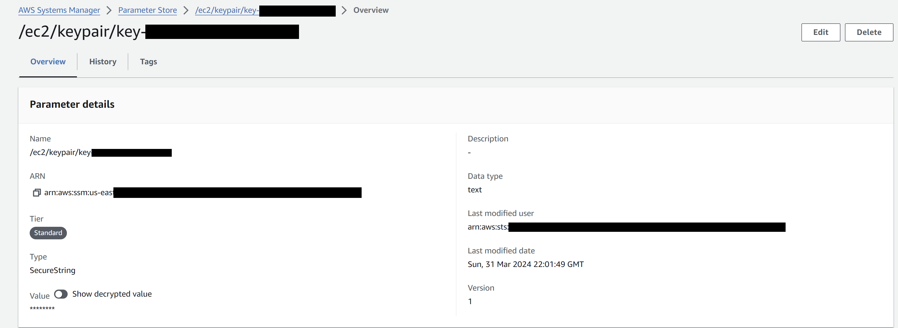
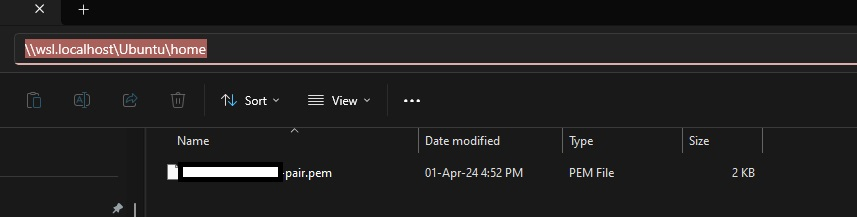
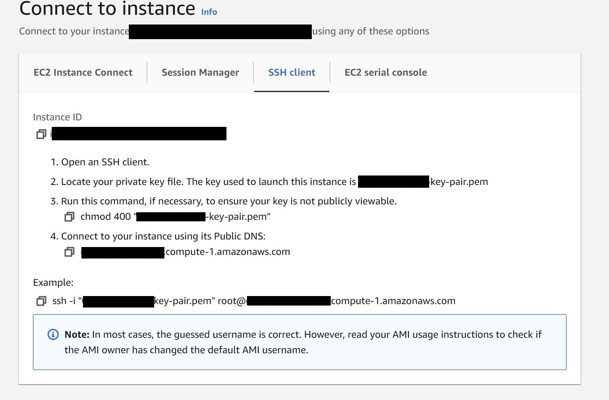

# Milestone 3

- ## Launching an EC2 Instance

An `Amazon EC2` instance is utilised as an `Apache Kafka` client machine.

Log into youyr `AWS account` and access the `EC2` home page. Select `Launch instance` and name the `EC2 instance` something memorable i.e. <your_UserId>.

- ## Selecting an AMI

In the Application and OS Images (Amazon Machine Image) section, select the desired Amazon Machine Image (`AMI`) i.e  `Amazon Linux 2 AMI(HVM)`.

An `AMI` includes the root file system, launch permissions, and block device mappings. It provides a complete package that allows you to quickly and easily launch instances with a specific operating system, software stack, and application environment.

- ## Selecting an Instance Type

Locate the desired `Instance type` and make your selction i.e. `t2.micro`. Then select `Launch instance` to launch your first instance. 

- ## Create a Key Pair 

Create your Key Pair name i.e.`<your_UserId>-key-pair` and select `Create key pair` which will create you the `<your_UserId>-key-pair.pem` to save.

It is essential to securely store your private key and prevent unauthorised access to it. 

- ## Connect to an EC2 instance via SSH client

SSH client is a widely used protocol for connecting to remote instances using SSH key pairs. To connect to an EC2 instance via SSH, you need to have the private key associated with the key pair used during instance launch as above or one created as below.

To create your Key Pair, a local `.pem` key file is created to establish a `SSH` connection with the `EC2` instance.
Navigate to the `Paramter Store` in the AWS account and use the `KeyPairId` accosiated with the EC2 instance created; given by AiCore. Using your `KeyPairId` find the specific key pair associated with the EC2 instance. Select this key pair and under the `Value` field select 'Show decrypted value'. This will reveal the content of your key pair. Copy its entire value (including the BEGIN and END header) and paste it in the `.pem` file in `VSCode`.



Navigate to the `EC2` console on `AWS` and identify the instance with your unique `<your_UserId>`. Select this instance, and under the `Details` section find the `key pair name` and make a note of this. Save the previously created `.pem` file in `VSCode` using the following format: `<your_UserId>-key-pair.pem`. Move this file into the linux home directory, "\\wsl.localhost\Ubuntu\home"



Alternatively rather than moving the `.pem` file you can create this via being in the desired destination/terminal as outlined below. Note, once you pass the command `nano UserId-key-pair.pem`, paste in the `Value` copied from earlier.

```wsl
(base) root@DELL-laptop:/mnt/c/Users/chemi/AiCore_Projects/pinterest-data-pipeline905## cd /
(base) root@DELL-laptop:/## ls
bin  boot  dev  etc  home  init  lib  lib32  lib64  libx32  lost+found  media  mnt  opt  proc  root  run  sbin  snap  srv  sys  tmp  usr  var
(base) root@DELL-laptop:/## cd home
(base) root@DELL-laptop:/home## nano <your_UserId>-key-pair.pem
(base) root@DELL-laptop:/home## ls
<your_UserId>-key-pair.pem
```
KEY: <your_UserId>: replace with your own details

Then connect to the `EC2` instance using `SSH` client instructions provided via AWS Cloud in the `EC2` console>Instances, open the EC2 instance and select `Connect`.



Continuing from the terminal above where the `.pem` file is located. Set the the appropriate permissions for the private key file to ensure it is only accessible by the owner: 

```wsl
chmod 400 /path/to/private_key.pem
```

Then use the `SSH command` from the `Connect to instance`> `SSH client` tab and look under `Example`. The command has the following structure: 

```wsl
ssh -i /path/to/private_key.pem ec2-user@public_dns_name. 
```

If you are already in the folder where your `.pem` file is located you don't need to specify the file path.

```wsl
(base) root@DELL-laptop:/home## ls -al
total 12
drwxr-xr-x  2 root root 4096 Apr  1 16:52 .
drwxr-xr-x 19 root root 4096 Apr  1 16:49 ..
-rw-r--r--  1 root root 1675 Apr  1 16:52 <your_UserId>-key-pair.pem
(base) root@DELL-laptop:/home## chmod 400 "<your_UserId>-key-pair.pem"
(base) root@DELL-laptop:/home## ls -al
total 12
drwxr-xr-x  2 root root 4096 Apr  1 16:52 .
drwxr-xr-x 19 root root 4096 Apr  1 16:49 ..
-r--------  1 root root 1675 Apr  1 16:52 <your_UserId>-key-pair.pem
(base) root@DELL-laptop:/home## ssh -i "<your_UserId>-key-pair.pem" ec2-user@public_dns_name
The authenticity of host '<public_dns_name> (data)' can't be established.
data key fingerprint is data.
This key is not known by any other names
Are you sure you want to continue connecting (yes/no/[fingerprint])? y
Please type 'yes', 'no' or the fingerprint: yes
Warning: Permanently added 'public_dns_name' (data) to the list of known hosts.
```
KEY: data: sensitive data removed, public_dns_name: replace this with actual details, <your_UserId>: replace with your own details

When accessing the EC2 client using SSH for the first time you may encounter a message about the authenticity of the host. This message is prompted because the SSH client does not recognise the remote host and wants to verify its authenticity to ensure secure communication. You can type yes to confirm and continue connecting. The key fingerprint will be stored in your SSH client's known_hosts file, and future connections to the same host will not prompt the same message. If during this process you are logged off the instance just run the ssh command again and you will be reconnected.

If you are not able to successfully run the ssh connect command, this means your security group rules might need to be updated.

- ## Set up Kafka on the EC2 instance

Access to an `IAM authenticated MSK cluster` was provided by AiCore. To connect to the `IAM authenticated cluster`, install the appropriate packages on your `EC2` client machine.

Install Kafka on your client `EC2` machine. Security rules for the `EC2` instance to allow communication with the MSK cluster have already been provisioned for but are set up as follows:

Check the client machine can send data to the MSK cluster, by checking the Security groups of the cluster Virtual Private Cloud (VPC). To access this, open the `VPC console` and under `Security` choose Security groups. Select the default security group associated with the cluster VPC. Choose Edit inbound rules and select Add rule. In the Type column choose All traffic. In the Source column add the ID of the security group of the client machine (this can be found in the EC2 console). Once you choose Save rules, your cluster will accept all traffic from the client machine.

Make sure to install the same version of Kafka on the EC2 client; as the one the cluster is running in AWS MSK (2.12-2.8.1), otherwise there will be no communication with the MSK cluster.

On the client EC2 machine install `Java` 1.8.0 with the following command:

```wsl
cd /home/ec2-user
sudo yum install java-1.8.0
```

Followed by installation of `Apache Kafka` 2.12-2.8.1:

```wsl
wget https://archive.apache.org/dist/kafka/2.8.1/kafka_2.12-2.8.1.tgz 
```

Then extraction of Apache Kafka:

```wsl
tar -xzf kafka_2.12-2.8.1.tgz
```

Running the following command will show you the `Kafka directory` inside your EC2 client: 

```wsl
cd /home/ec2-user
ls -al
```

- ## IAM authentication set up on the EC2 instance

To connect to a cluster that uses `IAM authentication`, navigate to your Kafka installation folder and then in the libs folder. Inside here download the `IAM MSK authentication package` from Github, using the following command:

```wsl
cd /home/ec2-user/kafka_2.12-2.8.1/libs
wget https://github.com/aws/aws-msk-iam-auth/releases/download/v1.1.5/aws-msk-iam-auth-1.1.5-all.jar
```

- ## Setting up CLASSPATH environment variable

Creating the `CLASSPATH` environment variable and assigning it the location of the aws-msk-iam-auth-1.1.5-all.jar file ensures that the Kafka client can seamlessly access the Amazon MSK IAM libraries, regardless of the working directory from which the commands are run.

To set up the `CLASSPATH` environment variable, use the command:

```wsl
export CLASSPATH=/home/ec2-user/kafka_2.12-2.8.1/libs/aws-msk-iam-auth-1.1.5-all.jar
```

But make sure that the specified path is the same as on your EC2 client machine.

- ## Setting up CLASSPATH in .bashrc

When opening a new session or restarting an EC2 instance, any environment variables set in previous sessions will not persist. Therefore, to maintain the `CLASSPATH` environment variable across sessions, add the export command to the .bashrc file in the ec2-user home directory.

On the EC2 client run command:

```wsl
cd /home/ec2-user/
nano ~/.bashrc
```

Add the same export command to the .bashrc file:

```python
export CLASSPATH=/home/ec2-user/kafka_2.12-2.8.1/libs/aws-msk-iam-auth-1.1.5-all.jar
```

Save the changes inserted into the .bashrc.

After making changes to the .bashrc file, run the source command to apply the changes to the current session:

```wsl
source ~/.bashrc
```

To verify if the CLASSPATH environment variable was correctly set, use the echo command to display its value:

```wsl
echo $CLASSPATH
```

If the CLASSPATH was set correctly, this command will output the path assigned to it, which in this case is /home/ec2-user/kafka_2.12-2.8.1/libs/aws-msk-iam-auth-1.1.5-all.jar.

- ## Configuring Kafka Client to use AWS IAM

Before configuring your EC2 client to use AWS IAM for cluster authentication, you:

Navigate to the `IAM` console on your AWS account and select the Roles section.
Select the one with the following format: <your_UserId>-ec2-access-role and copy this role `ARN` and make a note of it, as it is required later for the cluster authentication.
Go to the Trust relationships tab and select Edit trust policy.
Click on the Add a principal button and select IAM roles as the Principal type.
Replace ARN with the <your_UserId>-ec2-access-role `ARN` you have just copied.
By following the steps above you will be able to now assume the <your_UserId>-ec2-access-role, which contains the necessary permissions to authenticate to the MSK cluster.

Next navigate to your Kafka installation folder in the `EC2` instance, and then into the `bin` folder:

```wsl
cd /home/ec2-user/kafka_2.12-2.8.1/bin
```

Here create a client.properties file, using the following command:

```wsl
nano client.properties
```

The client's configuration file should contain the following (using the noted `ARN` from before, replace the `ARN` within the quotations marks):

```python
## Sets up TLS for encryption and SASL for authN.
security.protocol = SASL_SSL

## Identifies the SASL mechanism to use.
sasl.mechanism = AWS_MSK_IAM

## Binds SASL client implementation. Uses the specified profile name to look for credentials.
sasl.jaas.config = software.amazon.msk.auth.iam.IAMLoginModule required awsRoleArn="ARN";

## Encapsulates constructing a SigV4 signature based on extracted credentials.
## The SASL client bound by "sasl.jaas.config" invokes this class.
sasl.client.callback.handler.class = software.amazon.msk.auth.iam.IAMClientCallbackHandler
```

- ## Create Kafka topics

To create a topic, you first select the desired cluster from the `MSK` console in `AWS` and then retrieve and make a note of the `Bootstrap servers` (`BOOTSTRAP_SERVER_STRING`) and `Plaintext Apache Zookeeper connection strings` (`ZOOKEEPER_CONNECTION_STRINGS`) via the 'View client information' button.

Then in the EC2 client machine create the following three <topics_names>:

- `<your_UserId>.pin` for the Pinterest posts data
- `<your_UserId>.geo` for the post geolocation data
- `<your_UserId>.user` for the post user data

From within <KAFKA_FOLDER>/bin, run the following command three times one for each topic, replacing BOOTSTRAP_SERVER_STRING with the connection string previously saved, and <topic_name> with the desired topic name:

```wsl
cd /home/ec2-user/kafka_2.12-2.8.1/bin
./kafka-topics.sh --bootstrap-server BOOTSTRAP_SERVER_STRING --command-config client.properties --create --topic <topic_name>
```