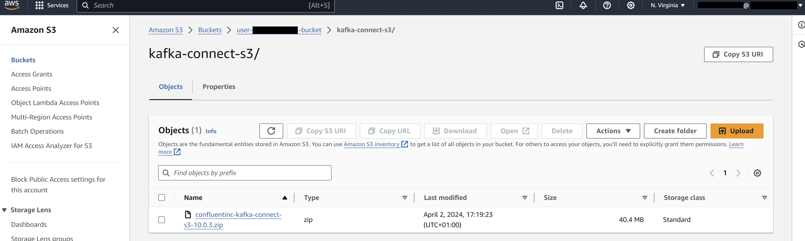

# Milestone 4

- ## Create the custom plugin

A plugin will contain the code that defines the logic of the connector. Use the client EC2 machine previously used to connect to the cluster in this step.

First go to the `S3` console and find the bucket that contains your <your_UserId>. The bucket name should have the following format: `user-<your_UserId>-bucket`. Make a note of the bucket name (`<BUCKET_NAME>`) for later.

Then, connect to the client `EC2` machine and download the `Confluent.io Amazon S3 Connector`. Then copy it to the S3 bucket. This connector is a sink connector that exports data from `Kafka` topics to `S3` objects in either `JSON`, `Avro` or `Bytes` format. To download and copy this connector run the code below inside the client machine:

```wsl
## assume admin user privileges
sudo -u ec2-user -i
## create directory where we will save our connector 
mkdir kafka-connect-s3 && cd kafka-connect-s3
## download connector from Confluent
wget https://d1i4a15mxbxib1.cloudfront.net/api/plugins/confluentinc/kafka-connect-s3/versions/10.0.3/confluentinc-kafka-connect-s3-10.0.3.zip
## copy connector to our S3 bucket
aws s3 cp ./confluentinc-kafka-connect-s3-10.0.3.zip s3://<BUCKET_NAME>/kafka-connect-s3/
```
KEY: Make sure to replace <BUCKET_NAME> with `user-<your_UserId>-bucket`

Follow up and check inside the `S3` bucket that this has completed:



Open the bucket `user-<your_UserId>-bucket` and the newly created folder kafka-connect-s3/. Select the zip file and note the `S3 URI` for later.

Then open the `MSK` console and select `Customised plugins` under the `MSK Connect` section on the left side of the console. Select `Create customised plugin` and paste the `S3 URI` of the .zip file or navigate and browse the S3 bucket for the Confluent connector ZIP file that was uploaded. Give the plugin a name, `<your_UserId>-plugin`, and select 'Create customed plugin'.

You can now create a connector using this custom plugin

- ## Create the connector

In the `MSK` console, select `Connectors` under the `MSK Connect` section on the left side of the console. Select the 'Create connector'.

In the list of plugin, select the plugin created, and click Next. Name the connector `<your_UserId>-connector` and choose the desired MSK cluster from the cluster list.

In the 'Connector configuration' settings copy the following configuration and replace `<your_UserId>` and `<BUCKET_NAME>` (`user-<your_UserId>-bucket`) with personal details:

```python
connector.class=io.confluent.connect.s3.S3SinkConnector
## same region as our bucket and cluster
s3.region=us-east-1
flush.size=1
schema.compatibility=NONE
tasks.max=3
## include nomeclature of topic name, given here as an example will read all data from topic names starting with msk.topic....
topics.regex=<your_UserId>.*
format.class=io.confluent.connect.s3.format.json.JsonFormat
partitioner.class=io.confluent.connect.storage.partitioner.DefaultPartitioner
value.converter.schemas.enable=false
value.converter=org.apache.kafka.connect.json.JsonConverter
storage.class=io.confluent.connect.s3.storage.S3Storage
key.converter=org.apache.kafka.connect.storage.StringConverter
s3.bucket.name=<BUCKET_NAME>
```

Note the topics.regex field in the connector configuration has the following structure: <your_UserId>.*, which enables the data going through all the three previously created Kafka topics will get saved to the S3 bucket.

Leave the rest of the configurations as default, except for:

'Capacity type', change to 'Provisioned' and make sure both the 'MCU count per worker' and 'Number of workers' are set to 1.
'Worker Configuration', select 'Use a customised configuration', then select `confluent-worker`.
'Access permissions', where you should select the `IAM role` you have created previously, `<your_UserId>-ec2-access-role`. This is the same role previously used for authentication on the EC2 client, and contains all the necessary permissions to connect to both MSK and MSK Connect.
Skip the rest of the pages until you get to 'Create connector' button page. Once your connector is up and running you will be able to visualise it in the 'Connectors' tab in the `MSK` console.

The plugin-connector pair has now been set up. Data passing through the `IAM authenticated cluster`, will be automatically stored in the designated `S3` bucket.