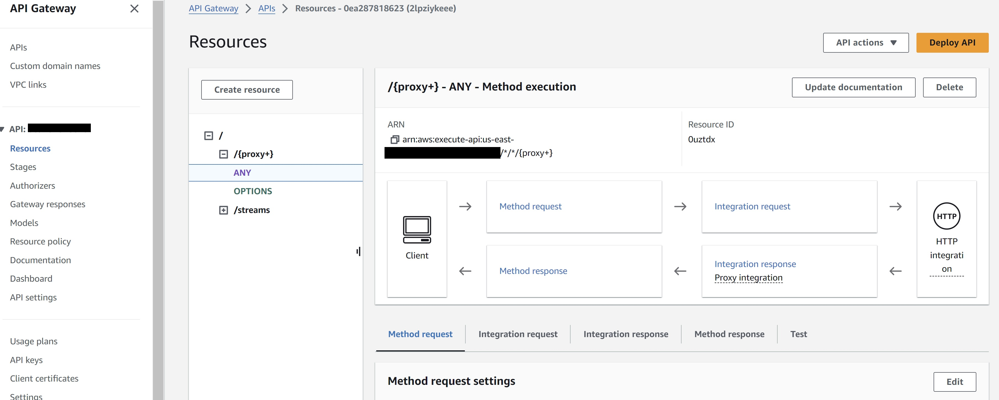
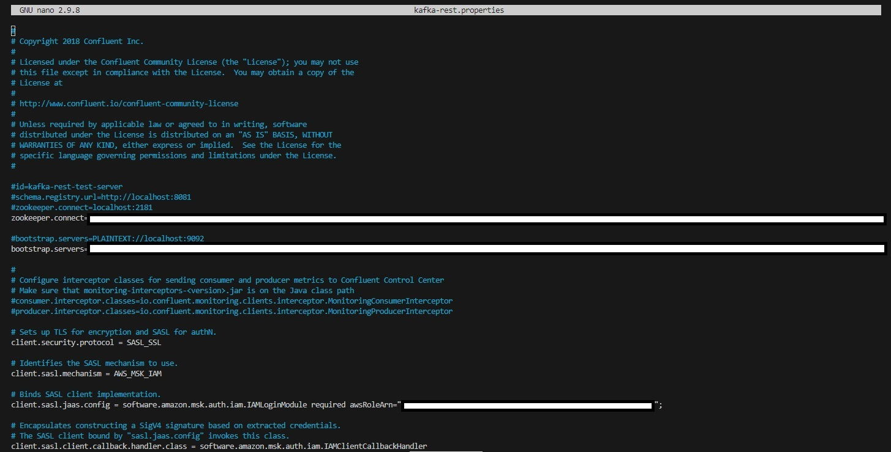
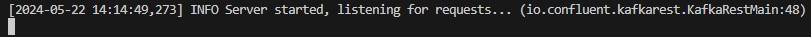
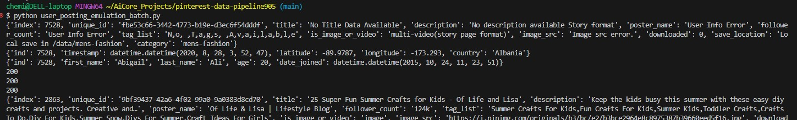
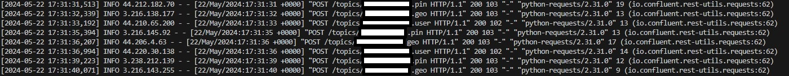
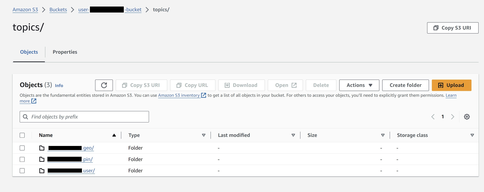
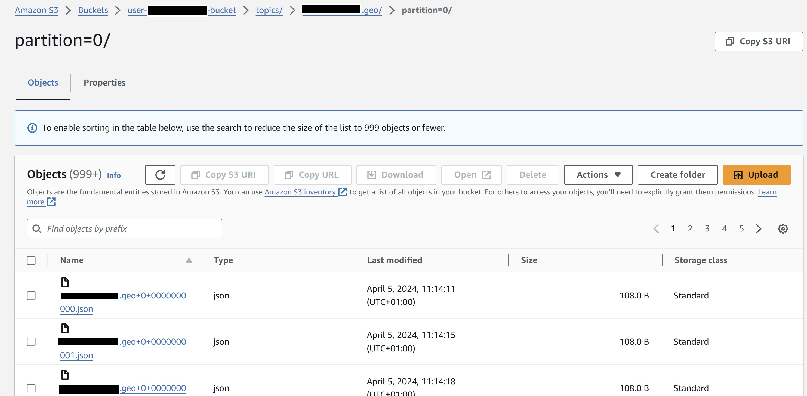

# Milestone 5

- ## Build a Kafka REST proxy integration method for the API and Deploy API

The `API` was provided by the administrator, AiCore, with the same name as the <your_UserId>. It was made via the `API Gateway` console in AWS by selecting the 'Create API' button>REST API, 'Build' button>Selecting 'New API', 'Regional' from the 'API endpoint type' drop down tab and selecting 'Create API'.

From within the `API Gateway` console select the `API` (<your_UserId>) and create the resource to build a PROXY integration for your API. Select 'Create resource' to create a new child resource for the `API`. Select the 'Proxy resource' toggle, enter '{proxy+}' under 'Resource name' and enable 'CORS' (Cross Origin Resource Sharing). Finally selecting 'Create resource' button as seen below.


When creating the proxy integration, it provides access to many resources and features at once, without specifying multiple resource paths using the greedy parameter, {proxy+}. 

For the previously created resource, '{proxy+}', the integration is set up by selecting the 'ANY' resource (allowing access to all available resources) followed by the 'Edit integration' button. Under the Edit integration request > Method details, select 'HTTP' and toggle the 'HTTP proxy integration'. For 'HTTP method' select 'ANY' and for 'Endpoint URL' enter the Kafka Client Amazon EC2 Instance Public IPv4 DNS (obtained by navigating to the EC2 console and selecting the client EC2 machine, looking for Public IPv4 DNS and copying this). The endpoint URL has the following format: http://KafkaClientEC2InstancePublicDNS:8082/{proxy}



Select the 'Deploy API' button from the top-right corner of the API page.

Select '*New stage*' from the 'Stage' drop down and enter desired stage name i.e. prod (for production) and select 'Deploy'. Note the 'Invoke URL' for later.

Your external Kafka REST proxy, which was exposed through API Gateway will look like:

https://YourAPIInvokeURL/<prod>/topics/<AllYourTopics>

This URL is required when sending messages through the API Gateway into the Kafka consumer.

- ## Set up the Kafka REST proxy on the EC2 client via Confluent package installation

Now with the `Kafka REST Proxy integration` complete, the `Kafka REST Proxy` on your `EC2` client machine is next set up via installation of the `Confluent package`. This allows data to be consumed using `MSK` from the `API` just created. Download the following `Confluent package` to the client `EC2` machine, that will be used to communicate with the `MSK cluster`.

To install the `REST proxy package` run the following commands from the `EC2` instance:

```wsl
sudo wget https://packages.confluent.io/archive/7.2/confluent-7.2.0.tar.gz
tar -xvzf confluent-7.2.0.tar.gz 
```
- ## Allow the REST proxy to perform IAM authentication to the MSK cluster 

To configure the `REST proxy` to communicate with the desired `MSK cluster`, and to perform `IAM authentication`, navigate to `confluent-7.2.0/etc/kafka-rest` and modify the `kafka-rest.properties` file:

```wsl
cd /home/ec2-user/confluent-7.2.0/etc/kafka-rest
nano kafka-rest.properties
```

The `bootstrap.servers` and the `zookeeper.connect` variables in this file are modified with the corresponding `Boostrap server string` (`BOOTSTRAP_SERVER_STRING`) and `Plaintext Apache Zookeeper connection string` (`ZOOKEEPER_CONNECTION_STRINGS`) respectively that have been saved from before (found under Amazon MSK > Clusters). This allows the REST proxy to connect to the `MSK cluster`. Also, to surpass the `IAM authentication` of the `MSK cluster`, add the following to the kafka-rest.properties file:

```python
# Sets up TLS for encryption and SASL for authN.
client.security.protocol = SASL_SSL

# Identifies the SASL mechanism to use.
client.sasl.mechanism = AWS_MSK_IAM

# Binds SASL client implementation.
client.sasl.jaas.config = software.amazon.msk.auth.iam.IAMLoginModule required awsRoleArn="Your Access Role";

# Encapsulates constructing a SigV4 signature based on extracted credentials.
# The SASL client bound by "sasl.jaas.config" invokes this class.
client.sasl.client.callback.handler.class = software.amazon.msk.auth.iam.IAMClientCallbackHandler
```

KEY: Replace `Your Access Role` with the `ARN` found from navigating to the `IAM` console on the AWS account and selecting the Roles section. Select the one with the following format: <your_UserId>-ec2-access-role and copy this `ARN` role.



Notice the difference between the above `kafka-rest.properties` and the Kafka `client.properties` file set up earlier. To allow communication between the REST proxy and the cluster brokers, all configurations should be prefixed with `client`.

- ## Starting the REST proxy on the EC2 client machine

Before sending messages to the `API`, in order to make sure they are consumed in `MSK`. Start the `REST proxy` by following the command:

```wsl
cd /home/ec2-user/confluent-7.2.0/bin
./kafka-rest-start /home/ec2-user/confluent-7.2.0/etc/kafka-rest/kafka-rest.properties
```

This allows the proxy to receive requests from the `API`. The following message is seen from the `EC2` console: `INFO Server started, listening for requfifa states card for ests...`



Keep this terminal available for when data is being streamed into it via the execution of `user_posting_emulation_batch.py` script in the next step.

- ## Send data to the API

Pinterest data is sent to the `API`, which sends the data to the `MSK Cluster` using the `plugin-connector pair` previously created.

Modification of the `user_posting_emulation_basic.py` script to `user_posting_emulation_batch.py` allows sending data from the three tables to their corresponding `Kafka topics` using the `API` Invoke URL previously noted.

From within the project folder terminal, in a new terminal, run the following:

```python
python user_posting_emulation_batch.py
```

This script generates the following output:



The script executed above shows the data output from the 3 tables in succession and the returned successful status code of 200 respectively.

While the above is being executed, it is sending the records across to the `listening REST proxy` for which the terminal is open from before. This terminal shows the confirmation of every record being sent to the `API`:



- ## Checking Data has been ingested and stored in the S3 bucket

The `user_posting_emulation_batch.py` is run until a sufficient number of records have been generated and stored to the S3 bucket. The S3 bucket is checked to see if the data has been successfully ingested through Kafka:





Check if data is getting stored in the S3 bucket. Notice the folder organisation (e.g. topics/<your_UserId>.pin/partition=0/) that your connector creates in the bucket. Make sure your database credentials are encoded in a separate, hidden db_creds.yaml file.
