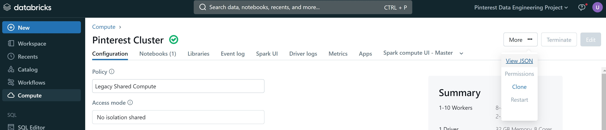
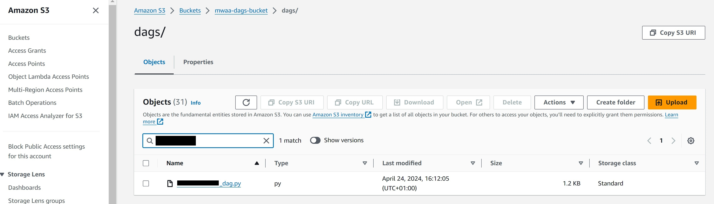
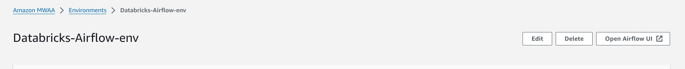
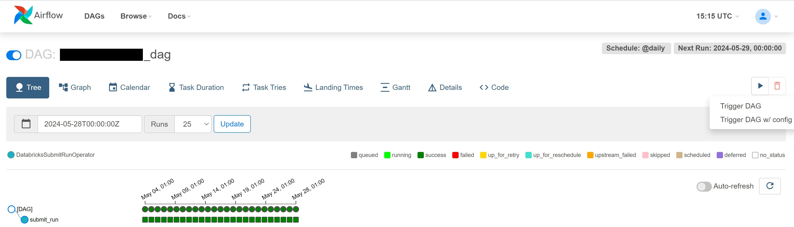

# Milestone 8

- ## Create and upload a DAG to a MWAA enviroment

Databricks Workloads are orchestrated on AWS MWAA (Managed Workflows for Apache Airflow).

The `AWS` account had been been provided with access to a MWAA environment `Databricks-Airflow-env` and to its `S3` bucket `mwaa-dags-bucket`. Thus it was not required to create an `API token` in Databricks to connect to the `AWS` account, to set up the `MWAA-Databricks connection` or to create the `requirements.txt` file.

An Airflow DAG that triggers a Databricks Notebook to run on a specific schedule was created, [your_UserId_dag.py](../your_UserId_dag.py). Note to find the `existing_cluster_id` required, navigate to the following, databricks > Compute > Cluster (i.e. 'Pinterest Cluster') > More ... > View JSON > cluster_id; as seen in the picture below. Also note to change the following in the DAG with your own details by replacing anything within '<>': 
- 'notebook_path': '</Workspace/Users/path/to/your/notebook>'
- 'owner': '<your_name>'
- start_date=datetime(<2024, 4, 24>)
- schedule_interval='@daily'
- existing_cluster_id='<existing_cluster_id>'

This DAG is uploaded to the dags folder on `AWS S3` in the `mwaa-dags-bucket` in the object `dags/` folder.

The DAG is scheduled to run daily.

- ## Trigger a DAG that runs a Databricks Notebook

From within `AWS MWAA` console, select the `Environment` i.e. `Databricks_airflow-env` followed by selecting the 'Open Airflow UI' button and manually trigger the DAG uploaded from the previous step and check it runs successfully.

