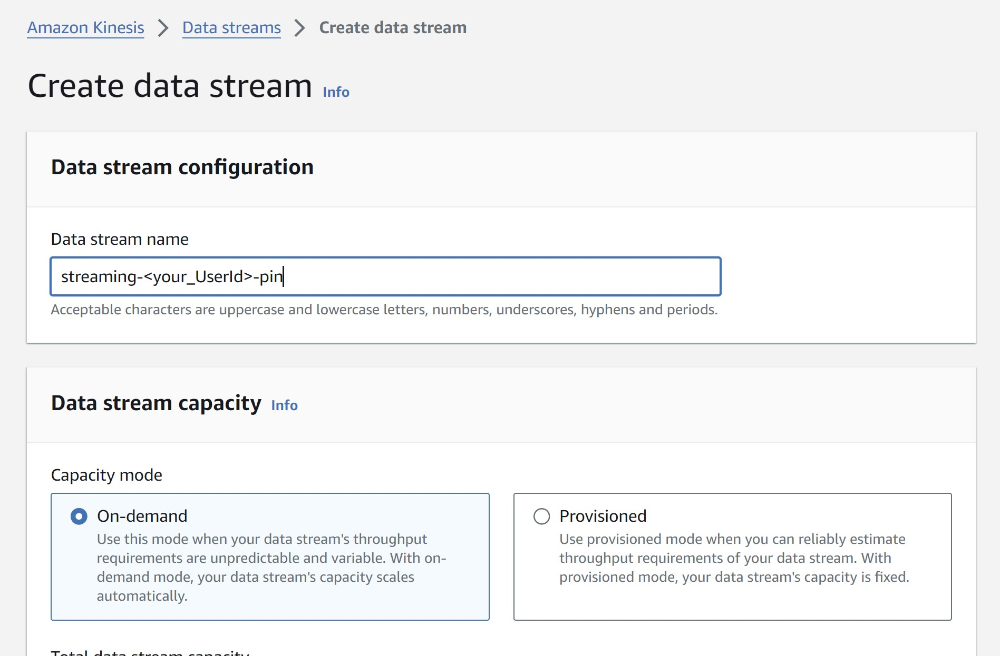

# Milestone 9

- ## Create data streams using Kinesis Data Streams

In AWS navigate to the Kinesis console and follow, Amazon Kineis > Data streams > select 'Create data stream' button.



Choose the desired name for your stream i.e. streaming-<your_UserId>-pin, and input this in the 'Data stream name' field. 

The 'On-demand' is selected from the 'Capacity mode' and click 'Create data stream'. When your stream is finished creating the status will change from 'Creating' to 'Active'.

This process is repeated to create the following three streams:

- streaming-<your_UserId>-pin
- streaming-<your_UserId>-geo
- streaming-<your_UserId>-user


- ## Configure an API with Kinesis proxy integration

Configure the previously created REST API that was built for the 'Kafka REST proxy integration' to allow it to invoke Kinesis actions. The AWS account provided had been granted the necessary permissions to invoke Kinesis actions, so it was not required to create an IAM role for the API to access Kinesis.

The access role had the following structure: <your_UserId-kinesis-access-role>. The ARN of this role was copied from the IAM console, under Roles. This is used when setting up the Execution role for the integration point of all the methods created.

The API should be able will invoke the following actions:

- List streams in Kinesis
- Create, describe and delete streams in Kinesis
- Add records to streams in Kinesis

- ## List 'streams' in Kinesis

In AWS via the `API Gateway` console:

- Select the desired API that was created before i.e. <your_UserId> and navigate to the 'Resources' tab.
- Click 'Create resource' button to start provisioning a new resource.
- Under Resource name', type 'streams' and leave the rest as default and click the 'Create resource' button.


- ## Creating a 'GET' method for 'streams' resource

From the 'API Gateway' console, select the 'API' followed by the 'Resources' tab:  

- Select the created 'streams' resource, and 'Create method' button. 


- Under 'Method details':
    - Select 'GET' as the 'method type'
    - 'Integration' as 'AWS Service'
    - 'AWS Region' choose 'us'-east-1'
    - 'AWS Service' select 'Kinesis'
    - 'HTTP method' select 'POST' (as we will have to invoke Kinesis's ListStreams action)
    - 'Action Type' select 'Use action name'
    - 'Action name' type `ListStreams`
    - Execution role you should copy the `ARN` of your Kinesis Access Role (created in the previous section)
    - Click 'Create method' to finalise provisioning of this method

- ## Configuring the 'GET' method for 'streams' resource

- After carrying out the above you are redirected to the 'Method Execution' page, otherwise from the 'API Gateway' console, select the desired 'API' followed by the 'Resources' tab:

    - Select the 'GET' resource and click the 'Integration request' tab followed by the 'Edit' button
    - Expand the 'URL request headers parameters' panel
    - Under 'Name' type `Content-Type`
    - Under 'Mapped from' type `'application/x-amz-json-1.1'`

    

    - Expand the 'Mapping templates' panel
    - Choose 'Add mapping template' button
    - Under 'Content type' type `application/json`
    - Under 'Template body' type `{}` in the template editor
    - Click the 'Save' button

    

- ## Create, describe and delete streams in Kinesis

- From the 'API Gateway' console, select the 'API' followed by the 'Resources' tab:
    - Select 'streams' under 'Resources' to start creating a new `child resource` 
    - Select 'Create resource' and name the 'Resource name' as `{stream-name}` 
    - Leave the rest as default and select the 'Create resource' button

    

- ## Creating methods POST, GET and DELETE for the child resource

- The following three Methods for `/{stream-name}` resource is then created and configured: POST, GET and DELETE.
- Note: When creating the `GET`, `POST` and `DELETE` methods. Repeat the steps from before when creating and configuring of the `GET` method. Remember to change their respective 'Action name' and 'Template body' accordingly as below.

    - Select the `/{stream-name}` resource and click 'Create method' followed by selecting desired 'Method type'

        - `GET` method: 
            - 'Action name', type `DescribeStream`
            - 'Template body' type the following into the template editor:

                ```python
                {
                    "StreamName": "$input.params('stream-name')"
                }
                ```

        - `POST` method: 
            - 'Action name', type `CreateStream`
            - 'Template body' type the following into the template editor:

                ```python
                {
                    "ShardCount": #if($input.path('$.ShardCount') == '') 5 #else $input.path('$.ShardCount') #end,
                    "StreamName": "$input.params('stream-name')"
                }
                ```

        - `DELETE` method: 
            - 'Action name', type `DeleteStream`
            - 'Template body' type the following into the template editor:

                ```python
                {
                    "StreamName": "$input.params('stream-name')"
                }
                ```
            


- ## Add records to streams in Kinesis

- From the `/{stream-name}` resource, two new resources `/record` and `/records` are created with `PUT` method. This was done in the same way as before but with the their respective 'Action name' and 'Template body' details (see below).

    - Select the `/{stream-name}/record` resource and click 'Create method' followed by selecting desired 'Method type'

        - `PUT` method: 
            - 'Action name', type `PutRecord`
            - 'Template body' type the following into the template editor:

                ```python
                {
                    "StreamName": "$input.params('stream-name')",
                    "Data": "$util.base64Encode($input.json('$.Data'))",
                    "PartitionKey": "$input.path('$.PartitionKey')"
                }
                ```

    - Select the `/{stream-name}/records` resource and click 'Create method' followed by selecting desired 'Method type'

        - `PUT` method: 
            - 'Action name', type `PutRecords`
            - 'Template body' type the following into the template editor:

                ```python
                {
                    "StreamName": "$input.params('stream-name')",
                    "Records": [
                    #foreach($elem in $input.path('$.records'))
                        {
                            "Data": "$util.base64Encode($elem.data)",
                            "PartitionKey": "$elem.partition-key"
                        }#if($foreach.hasNext),#end
                        #end
                    ]
                }
                ```


Read Data from Kinesis Streams in Databricks:

In Databricks a new Databricks Notebook is created
Retrieve Access Key and Secret Access Key from the Delta table located at dbfs:/user/hive/warehouse/authentication_credentials.
Ingest data into Kinesis Data Streams and verify data reception in the Kinesis console.
Read data from the three created streams in the Databricks Notebook.
Transform Data from Kinesis Streams in Databricks:

Clean the streaming data similar to the batch data cleaning process.
Write Streaming Data to Delta Tables:

Save the cleaned streaming data into Delta Tables: <your_UserId>_pin_table, <your_UserId>_geo_table, and <your_UserId>_user_table.
Document Your Experience:

Document the process and steps taken during this milestone.
Update GitHub Repository:

Save the Databricks code to the local project repository.
Update the GitHub repository with the latest code changes:
Stage modifications, create a commit, and push changes.
Upload the architecture diagram created using the provided template.
This summary outlines the tasks and processes involved in setting up, sending, reading, and processing streaming data using AWS Kinesis and Databricks.


Task 3: Send data to the Kinesis streams

Create a new script user_posting_emulation_streaming.py, that builds upon the initial user_posting_emulation.py you have been provided with.


In this script, you should send requests to your API, which adds one record at a time to the streams you have created. You should send data from the three Pinterest tables to their corresponding Kinesis stream.


Make sure your database credentials are encoded in a separate, hidden db_creds.yaml file.

Task 4: Read data from Kinesis streams in Databricks

Step 1:
Create a new Notebook in Databricks and read in your credentials from the Delta table, located at dbfs:/user/hive/warehouse/authentication_credentials, to retrieve the Access Key and Secret Access Key. Follow the same process for this, as you have followed for your batch data.


Step 2:

Run your preferred method to ingest data into Kinesis Data Streams. In the Kinesis console, check your data streams are receiving the data.


Step 3:

Read the data from the three streams you have created in your Databricks Notebook.

Task 5: Transforms orm Kinesis streams in Databricks

Clean the streaming data in the same way you have previously cleaned the batch data.

Task 6: Write the streaming data to Delta Tables

Once the streaming data has been cleaned, you should save each stream in a Delta Table. You should save the following tables: <your_UserId>_pin_table, <your_UserId>_geo_table and <your_UserId>_user_table.

Task 7: Document your exp

Task 8: GitHub

Save the code you have created in Databricks to your local project repository.


Update your GitHub repository with the latest code changes from your local project. Start by staging your modifications and creating a commit. Then, push the changes to your GitHub repository.

Finally, you can upload the diagram of the architecture you created using this template .


